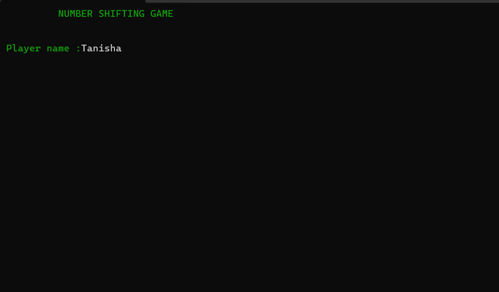

## About
It is a game consisting of 1 to 15 numbers and empty spaces in a matrix of order 4*4 following the random order.The primary goal of this game is to make in a sequential order of numbers from 1 to 15 within the specified number of attempts to win successfully.This has also the feature of trying again if you are not able to complete the goal in the specified turn.

## GAME PREVIEW
After running the program,the following preview will be displayed

